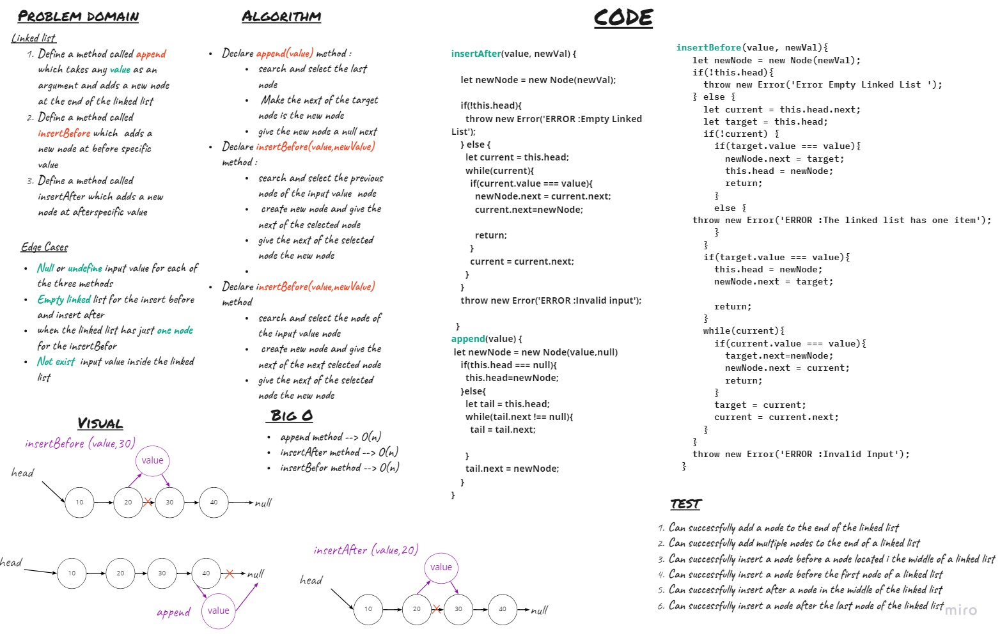
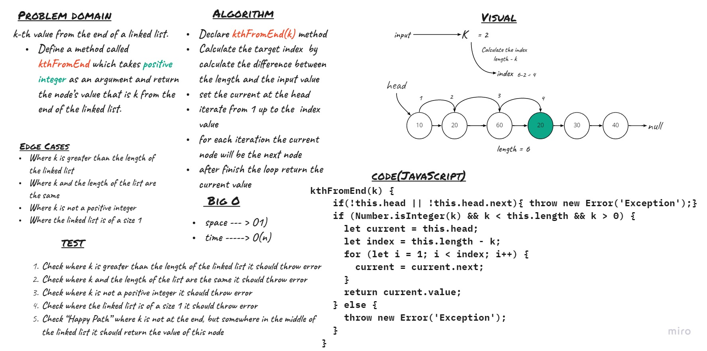

# Singly Linked List

Singly linked list can be defined as the collection of ordered set of elements. The number of elements may vary according to need of the program. A node in the singly linked list consist of two parts: data part and link part. Data part of the node stores actual information that is to be represented by the node while the link part of the node stores the address of its immediate successor.

# Challenge 05  
- Define a method called `insert` which takes any value as an argument and adds a new node with that value to the head of the list with an O(1) Time performance.
- Define a method called `includes` which takes any value as an argument and returns a boolean result depending on whether that value exists as a Node’s value somewhere within the list.
- Define a method called `toString` (or __str__ in Python) which takes in no arguments and returns a string representing all the values in the Linked List, formatted as:
"{ a } -> { b } -> { c } -> NULL"

## Approach & Efficiency

### **Big O**
* insert method --> O(1)
* includes method --> O(n)
* toString method --> O(n)

## API

* ` insert(value)` :
    Insert New Node with value at the linked list head .

* `include(value)` : 
    returns a boolean result depending on value if  exists as a Node’s value somewhere within the list.

* `toString` : 
    returns a string representing all the values in the Linked List

#   Challenge 06
Write the following methods for the Linked List class:

- `append(value)` which adds a new node with the given value to the end of the list
- `insertBefore(value, newVal)` which add a new node with the given newValue immediately before the first value node
- `insertAfter(value, newVal)` which add a new node with the given newValue immediately after the first value node

## Approach & Efficiency

### **Big O**
* append method 
    - time ---> O(n)
    - space ---> O(n)
* insertBefore method 
    - time ---> O(n)
    - space ---> O(n)
* insertAfter method 
    - time ---> O(n)
    - space ---> O(n)

## API

* ` append(value)` :
    Insert New Node with value at the end of the linked list  .

* `insertBefore(value, newVal)` : 
     Insert New Node with value before specific value .

* `insertAfter(value, newVal)` : 
    Insert New Node with value after specific value .

#   Challenge 07 
Write a method for the Linked List class which takes a number, k, as a parameter. Return the node’s value that is k from the end of the linked list. You have access to the Node class and all the properties on the Linked List class as well as the methods created in previous challenge

## Approach & Efficiency

### **Big O**
    - time ---> O(n)
    - space ---> O(1)

## API

 `kthFromEnd(k`) method 

Take a positive integer as an argument  

 Return the node’s value that is k from the end of the linked list. 

## Github Actions 

https://github.com/MousaSbbah/data-structures-and-algorithms/actions

