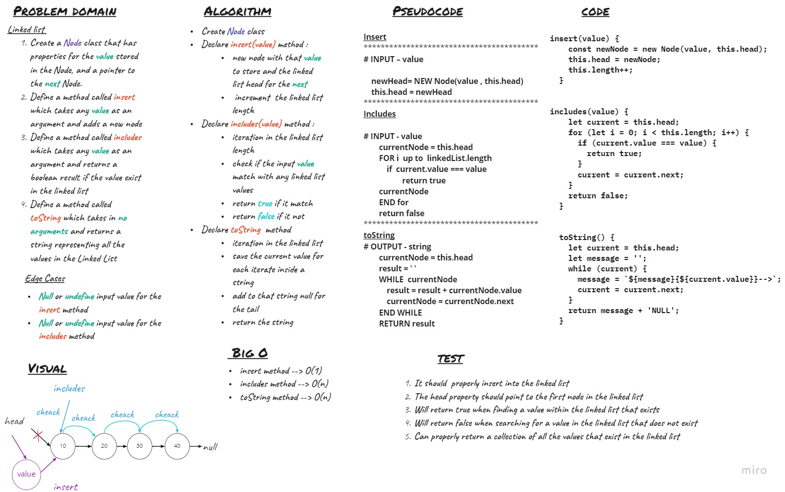

# Singly Linked List

Singly linked list can be defined as the collection of ordered set of elements. The number of elements may vary according to need of the program. A node in the singly linked list consist of two parts: data part and link part. Data part of the node stores actual information that is to be represented by the node while the link part of the node stores the address of its immediate successor.

## Challenge

## Approach & Efficiency

### **Big O**
* insert method --> O(1)
* includes method --> O(n)
* toString method --> O(n)

## API

* ` insert(value)` :
    Insert New Node with value at the linked list head .

* `include(value)` : 
    returns a boolean result depending on value if  exists as a Node’s value somewhere within the list.

* `toString` : 
    returns a string representing all the values in the Linked List
    
