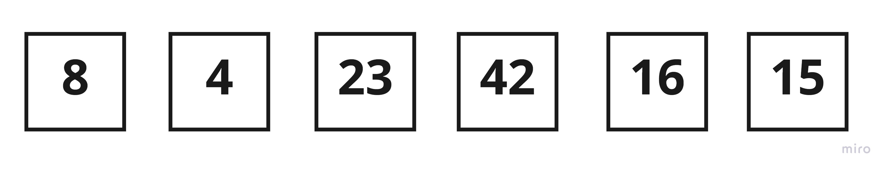
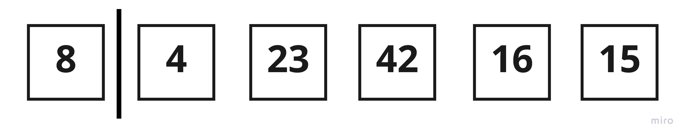
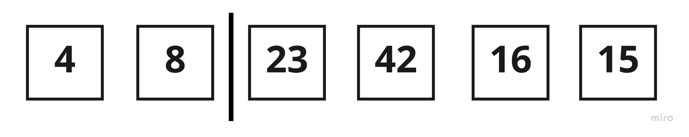
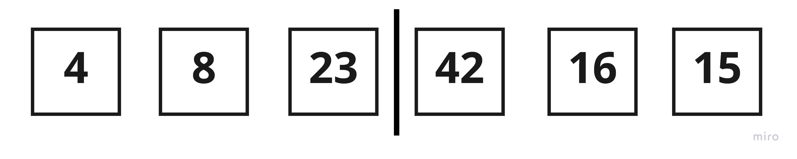
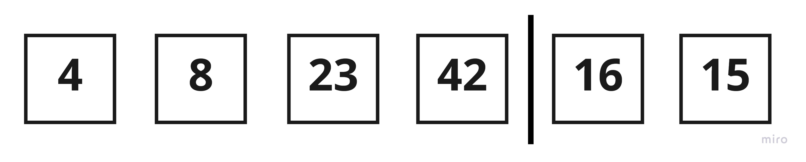
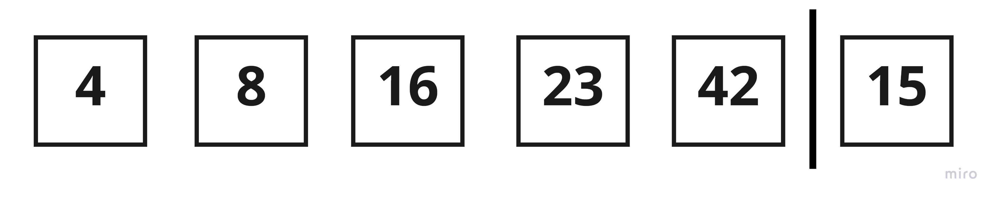
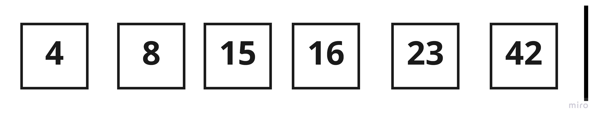

# Insertion Sort

Insertion sort is the sorting mechanism where the sorted array is built having one item at a time. The array elements are compared with each other sequentially and then arranged simultaneously in some particular order. The analogy can be understood from the style we arrange a deck of cards. This sort works on the principle of inserting an element at a particular position, hence the name Insertion Sort.

## Pseudocode
```
  InsertionSort(int[] arr)
  
    FOR i = 1 to arr.length
    
      int j <-- i - 1
      int temp <-- arr[i]
      
      WHILE j >= 0 AND temp < arr[j]
        arr[j + 1] <-- arr[j]
        j <-- j - 1
        
      arr[j + 1] <-- temp
```
## Trace
Sample Array: `[8,4,23,42,16,15]`


### Pass 1:
Pass 1 of Insertion Sort

To begin the sort, the code divides the sorted and unsorted sections of the list by placing a marker after the first number. To sort the numbers, it will repeatedly compare the first unsorted number with the numbers in the sorted section. If the unsorted number is smaller than its sorted neighbor, the code will swap them.

### Pass 2:

Pass 2 of Insertion Sort

The first number in the unsorted section is 8, so the code compares it with the number to the left. Since 8 is greater than 4, these numbers will swapped


### Pass 3:

Pass 3 of Insertion Sort

Now the first number in the unsorted section is 23. 8 is less than 23, so the code keep these numbers.


### Pass 4:

Pass 4 of Insertion Sort

Now the first number in the unsorted section is 42. 23 is less than 42, so the code keep these numbers.



### Pass 5:

Pass 5 of Insertion Sort

Now the first number in the unsorted section is 16. 16 is less than 42 and 23, 



so after tow comparisons and tow swaps, 16 arrives at the correct sorted position, and the computer advances the sort marker.



### Pass 6:

Pass 6 of Insertion Sort

Now the first number in the unsorted section is 15. 15 is less than 42, 23, and 16 


so after three comparisons and three swaps, 16 arrives at the correct sorted position, and the computer advances the sort marker.



## Efficency
**Time**:

 O(n^2)

The basic operation of this algorithm is comparison. This will happen n * (n-1) number of times…concluding the algorithm to be n squared.

**Space**: 

O(1)

No additional space is being created. This array is being sorted in place…keeping the space at constant O(1).