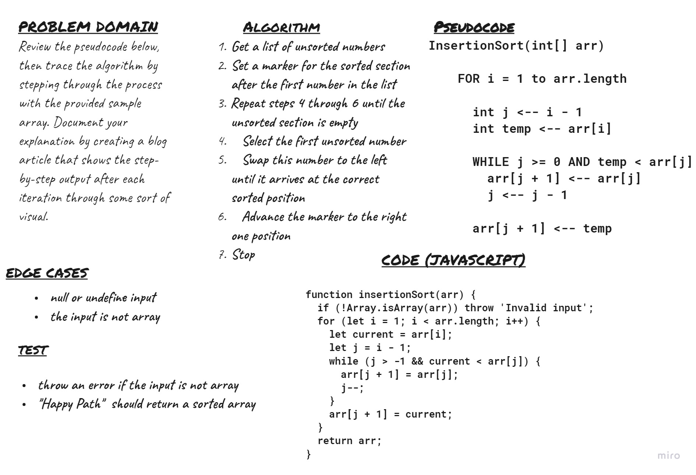

#   Challenge 26
Review the pseudocode below, then trace the algorithm by stepping through the process with the provided sample array. Document your explanation by creating a blog article that shows the step-by-step output after each iteration through some sort of visual.

Once you are done with your article, code a working, tested implementation of Insertion Sort based on the pseudocode provided.

## Approach & Efficiency

### **Big O**
* `space` : 

    O(1)

* `time` : 

O(n^2)

## API

- `insertionSort(array)`
     Sort an input array by use insertion sort algorithm 

     input ---> array

     Output ---> array

## Github Actions 

https://github.com/MousaSbbah/data-structures-and-algorithms/actions