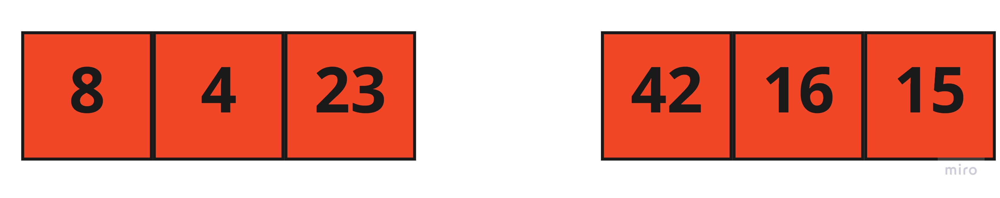
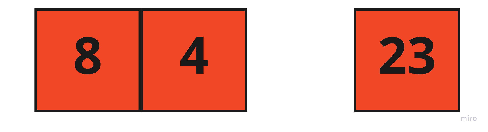
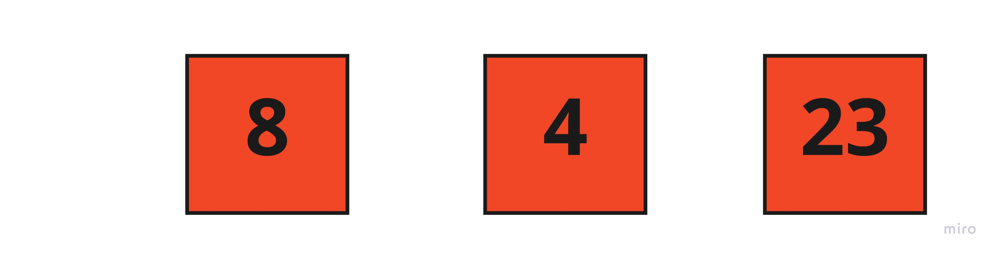
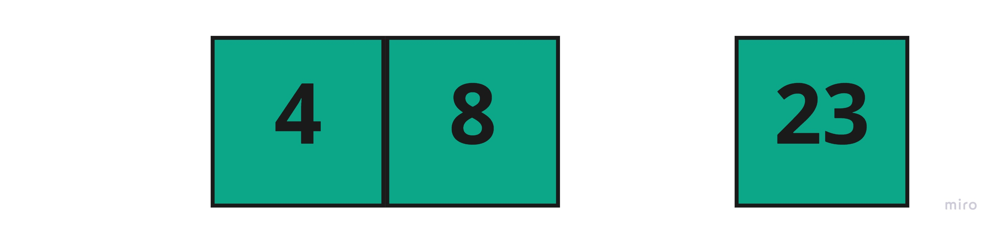
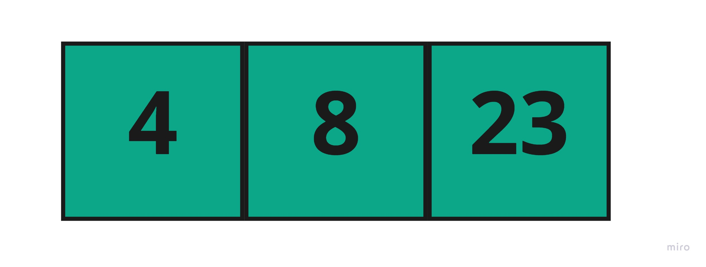
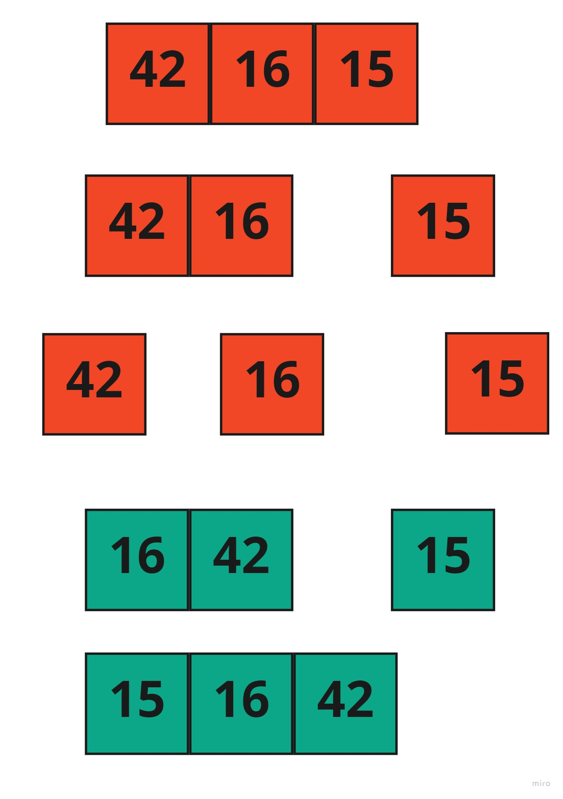
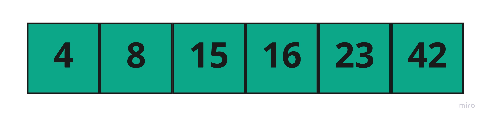

# Merge Sort

Merge Sort is a Divide and Conquer algorithm. It divides the input array into two halves, calls itself for the two halves, and then merges the two sorted halves. The merge() function is used for merging two halves. 
## Pseudocode
```
ALGORITHM Mergesort(arr)
    DECLARE n <-- arr.length
           
    if n > 1
      DECLARE mid <-- n/2
      DECLARE left <-- arr[0...mid]
      DECLARE right <-- arr[mid...n]
      // sort the left side
      Mergesort(left)
      // sort the right side
      Mergesort(right)
      // merge the sorted left and right sides together
      Merge(left, right, arr)

ALGORITHM Merge(left, right, arr)
    DECLARE i <-- 0
    DECLARE j <-- 0
    DECLARE k <-- 0

    while i < left.length && j < right.length
        if left[i] <= right[j]
            arr[k] <-- left[i]
            i <-- i + 1
        else
            arr[k] <-- right[j]
            j <-- j + 1
            
        k <-- k + 1

    if i = left.length
       set remaining entries in arr to remaining values in right
    else
       set remaining entries in arr to remaining values in left
```
## Trace
Sample Array: `[8,4,23,42,16,15]`


### 1. Start with the main array and divide it  to tow arrays 



### 2. call the function again in the left array 

So the left array will be divided to  new tow arrays



### 3. call the function again to this new arrays 

So the left array will be divided to  new tow arrays



### 4. Start compare and marge the values to new arrays and return it 

8 greater than 4 , So the 4 will be pushed first



### 5. Compare the first index with the values and dequeue the value and push i to returned array 

4 less than 23 ---> push   4

8 less than 23 ---> push   8

23  ---------------> push    23


### 6. Do exact to the same the right half of main array

### 7. at least merge the sorted right array with sorted left array

## Efficency
* `space` : 

    O(n)

* `time` : 

    O(n * log n)
