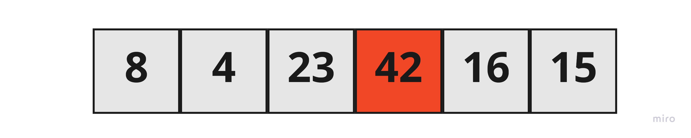
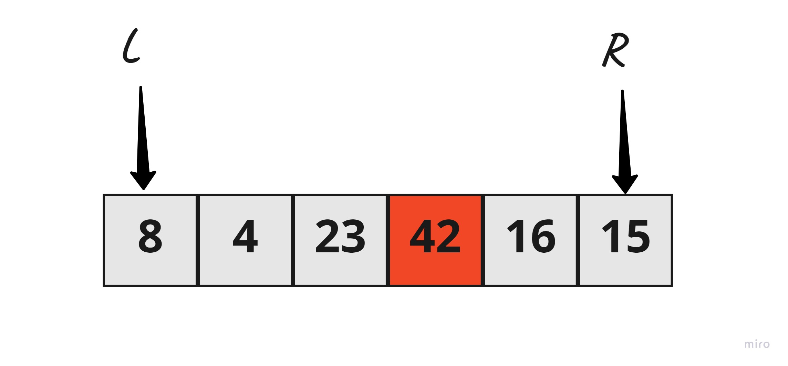
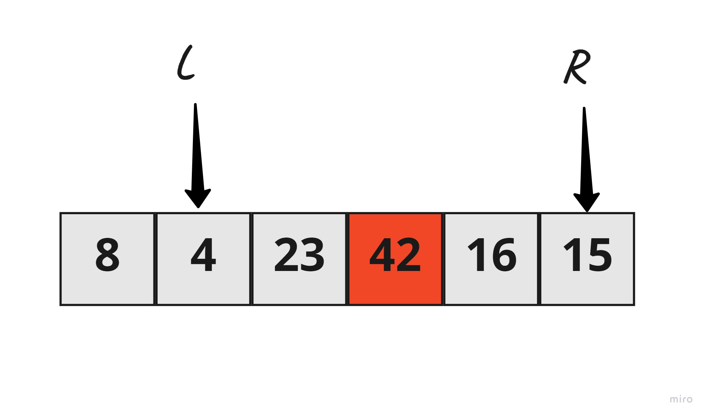
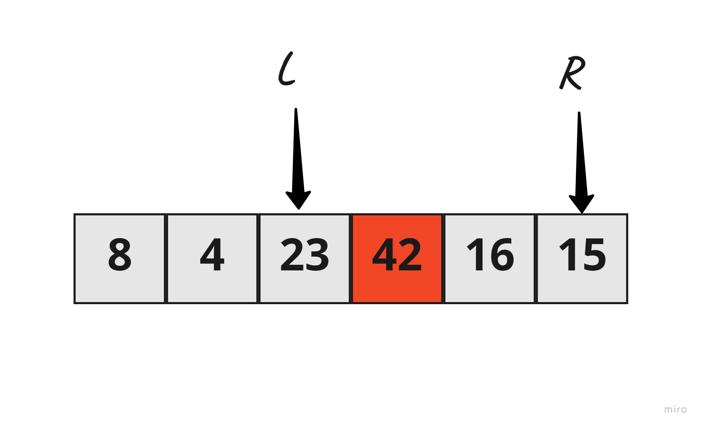
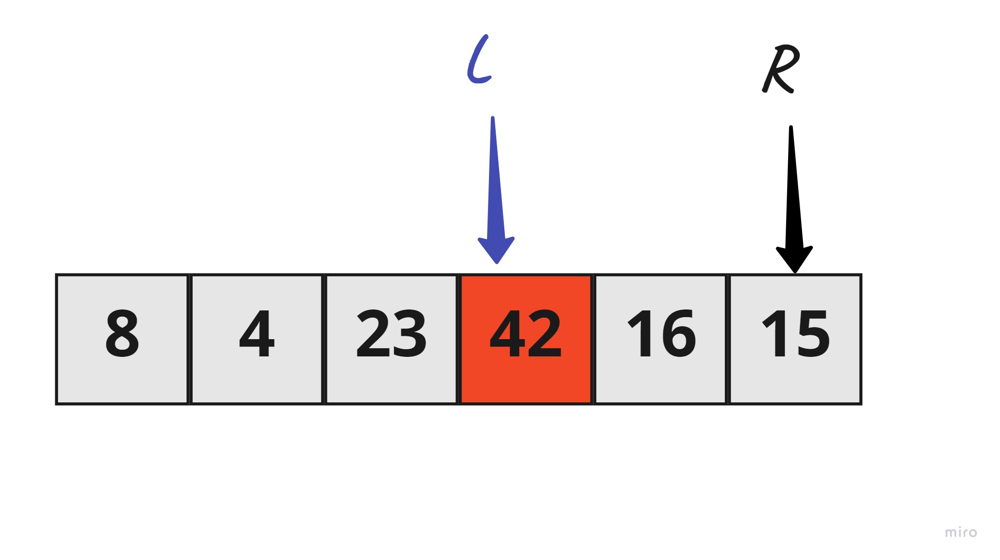
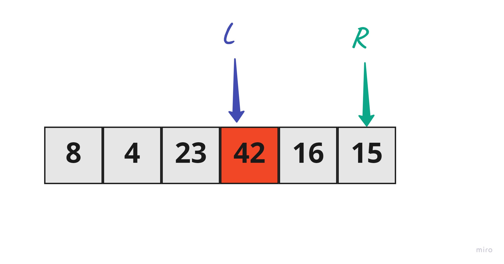
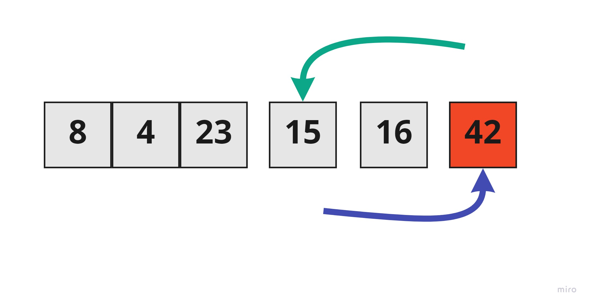
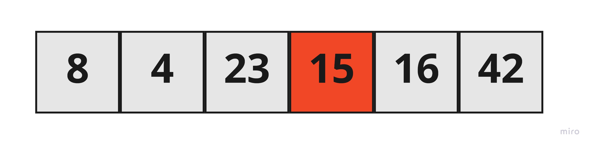

# Quick Sort

Quick sort follows Divide and Conquer algorithm. It is dividing elements in to smaller parts based on some condition and performing the sort operations on those divided smaller parts. Hence, it works well for large datasets. So, here are the steps how Quick sort works in simple words.

- First select an element which is to be called as pivot element.
- Next, compare all array elements with the selected pivot element and arrange them in such a way that, elements less than the pivot element are to it's left and greater than pivot is to it's right.
- Finally, perform the same operations on left and right side elements to the pivot element. 

## Pseudocode
```
ALGORITHM QuickSort(arr, left, right)
    if left < right
        // Partition the array by setting the position of the pivot value 
        DEFINE position <-- Partition(arr, left, right)
        // Sort the left
        QuickSort(arr, left, position - 1)
        // Sort the right
        QuickSort(arr, position + 1, right)

ALGORITHM Partition(arr, left, right)
    // set a pivot value as a point of reference
    DEFINE pivot <-- arr[right]
    // create a variable to track the largest index of numbers lower than the defined pivot
    DEFINE low <-- left - 1
    for i <- left to right do
        if arr[i] <= pivot
            low++
            Swap(arr, i, low)

     // place the value of the pivot location in the middle.
     // all numbers smaller than the pivot are on the left, larger on the right. 
     Swap(arr, right, low + 1)
    // return the pivot index point
     return low + 1

ALGORITHM Swap(arr, i, low)
    DEFINE temp;
    temp <-- arr[i]
    arr[i] <-- arr[low]
    arr[low] <-- temp
```
## Trace
Sample Array: `[8,4,23,42,16,15]`


### 1. Determine pivot as middle element. So, 42 is the pivot element.


### 2. Start left and right pointers as first and last elements of the array respectively. So, left pointer is pointing to 8 at index 0 and right pointer is pointing to 15 at index 5. 


### 3.  Compare element at the left pointer with the pivot element. Since, 8 < 42 shift left pointer to the right to index 1.



### 4.   Compare element at the left pointer with the pivot element. Since, 4 < 42 shift left pointer to the right to index 1.


### 5  Compare element at the left pointer with the pivot element. Since, 23 < 42 shift left pointer to the right to index 1.


### 6.   So now 42 = 42 stop incrementing the left pointer and now left pointer is at index 3..


### 7. Now, compare value at the right pointer with the pivot element.  since as 15 < 42 stop moving the right pointer.



### 8. Swap both values present at left and right pointers with each other. 

### 8. Repeat again 



## Efficency
* `space` : 

    O(n)

* `time` : 

    Θ(n^2)
