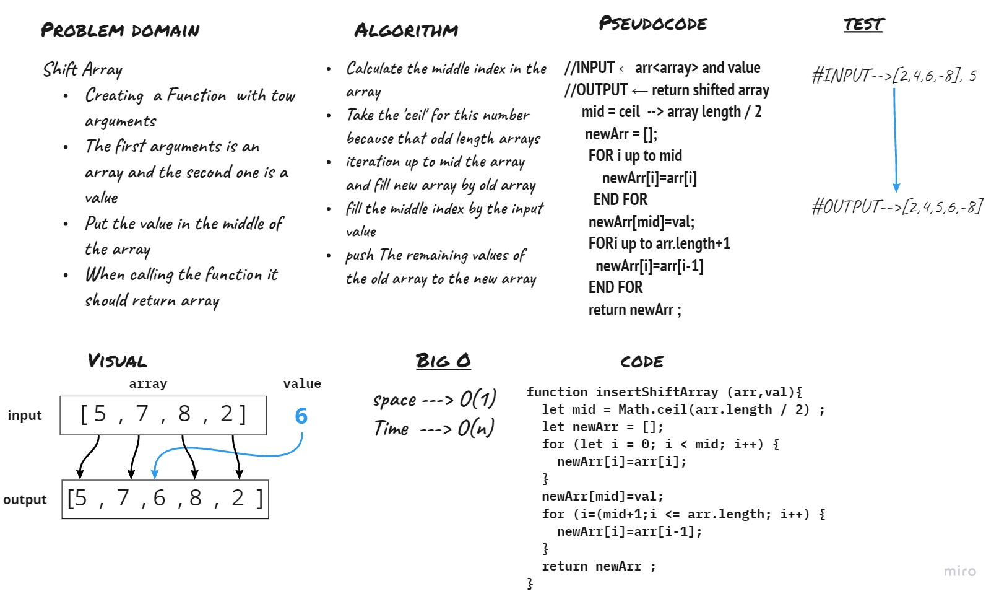

# **Shift Array**

Write a function called `insertShiftArray` which takes in an array and a value to be added. Without utilizing any of the built-in methods available to your language, return an array with the new value added at the middle index.

## Whiteboard Process

## Approach & Efficiency
Push the old array to the new one till the middle index
then push the input value then push the remaining old array to the new one  

### **BIG O** 
O(n)

