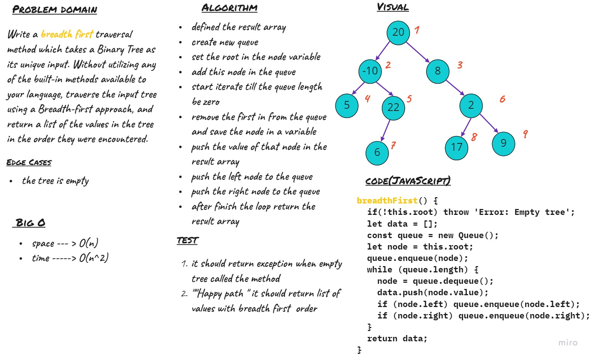

# Maximum Value in a Binary Tree
Write a `breadth first` traversal method which takes a Binary Tree as its unique input. Without utilizing any of the built-in methods available to your language, traverse the input tree using a Breadth-first approach, and return a list of the values in the tree in the order they were encountered.

## Challenge

## Approach & Efficiency
- `breadth first`
    - Time ---> O(n^2)
    - Space --> O(n)
 
## API

- `breadth first`
    return the array of list node in the tree with breadth first order
