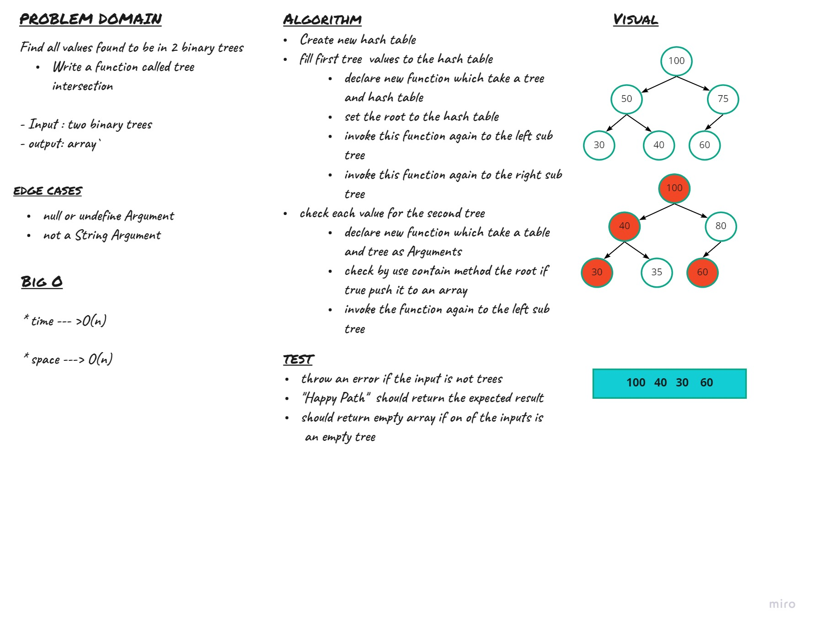

# Challenge 31
Find all values found to be in 2 binary trees
Write a function called tree intersection

- Input : two binary trees
- output: array`

## Challenge

## Approach & Efficiency

* time --- >O(n)

* space ---> O(n)

## API

- Input :tow `tree`
- output: `array`

