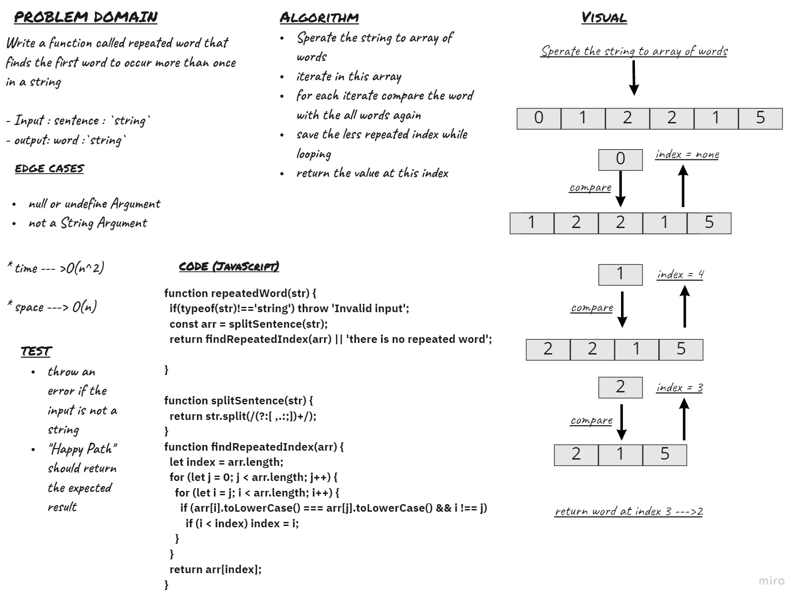

# Challenge 31
- Write a function called repeated word that finds the first word to occur more than once in a string
- Arguments: `string`
- Return: `string`

## Challenge

## Approach & Efficiency

* time --- >O(n^2)

* space ---> O(n)

## API

- Input : sentence : `string`
- output: word :`string`

