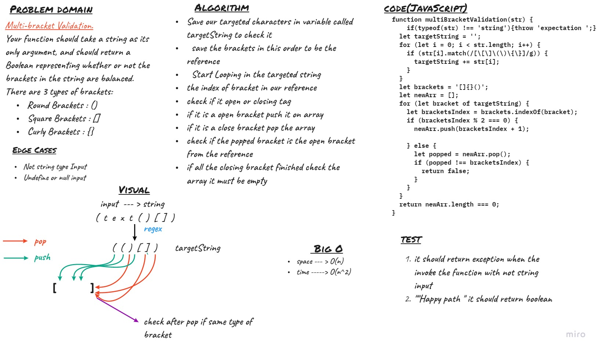

#   Challenge 13 : Multi-bracket Validation.
Create a function called `Multi-bracket Validation`.
Your function should take a string as its only argument, and should return a Boolean representing whether or not the brackets in the string are balanced. There are 3 types of brackets:

- Round Brackets : ()
- Square Brackets : []
- Curly Brackets : {}

## Approach & Efficiency

### **Big O**

- time --->O(n^2) 
- space --->O(n) 

## API
- `Multi-bracket Validation`
    - input -- > string
    - output -- >return a boolean representing whether or not the brackets in the string are balanced.

## Github Actions 

https://github.com/MousaSbbah/data-structures-and-algorithms/actions