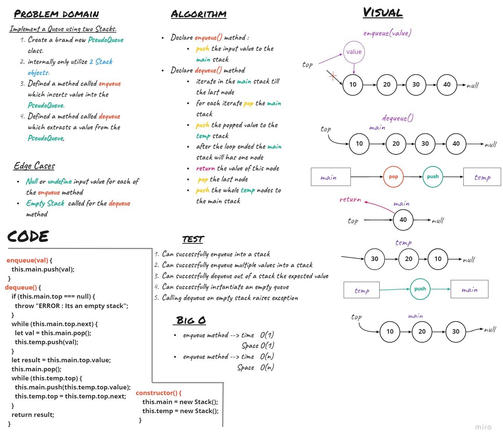

# Queue with Stack (PseudoQueue )
Create a brand new `PseudoQueue` class. , this PseudoQueue class will implement our standard queue interface (the two methods listed below), but will internally only utilize 2 Stack objects. Ensure that you create your class with the following methods:

* `enqueue(value)` which inserts value into the PseudoQueue, using a first-in, first-out approach.
* `dequeue()` which extracts a value from the PseudoQueue, using a first-in, first-out approach.

## Challenge

## Approach & Efficiency

- `enqueue` 
    first-in, first-out 

    * time --- >O(n)
    * space ---> O(1)

- `dequeue` 
    first-in, first-out
    
    * time --- >O(n)
    * space ---> O(n)

## API

**QUEUE**

- `enqueue` 

    Add input value to top of the  stack

- `dequeue` 

    remove   the last node on the stack and return the value of it
