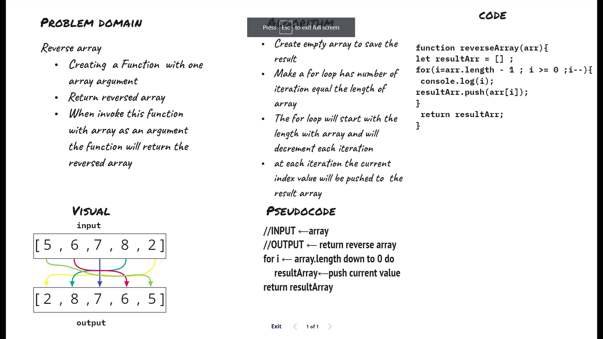

# **Reverse an array.**

Write a function called `reverseArray` which takes an array as an argument. Without utilizing any of the built-in methods available to your language, return an array with elements in reversed order.

## Whiteboard Process

## Approach & Efficiency

 reading the array from last index down to first index and save that values in a result array 

