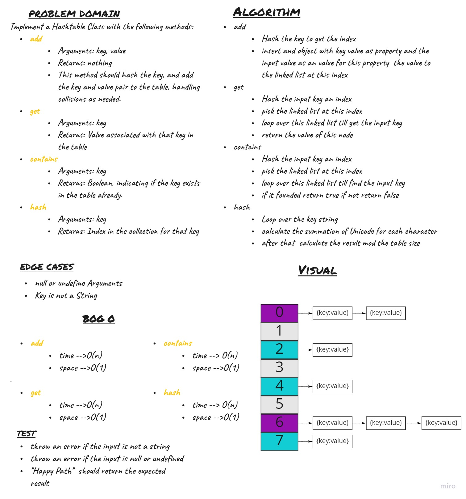

# Hash Table
Implement a Hashtable Class with the following methods:

- add
    - Arguments: key, value
    - Returns: nothing
    - This method should hash the key, and add the key and value pair to the table, handling collisions as needed.
- get
    - Arguments: key
    - Returns: Value associated with that key in the table
- contains
    - Arguments: key
    - Returns: Boolean, indicating if the key exists in the table already.
- hash
    - Arguments: key
    - Returns: Index in the collection for that key

## Challenge

## Approach & Efficiency
    - hash
        - Time ---> O(n)
        - Space --> O(1)
        
    - get
        -  Time ---> O(n)
        -  Space --> O(1)
    - add
        - Time ---> O(n)
        - Space --> O(1)
        
    - contains
        -  Time ---> O(n)
        -  Space --> O(1)
## API
    - hash
        - input ---> key :String
        - output --> index :Number
        
    - get
        - input ---> key :String
        - output --> Value :any
    - add
        - input ---> key :String, Value :any
        - output --> nothing
        
    - contains
        - input ---> Key :String
        - output --> Boolean

