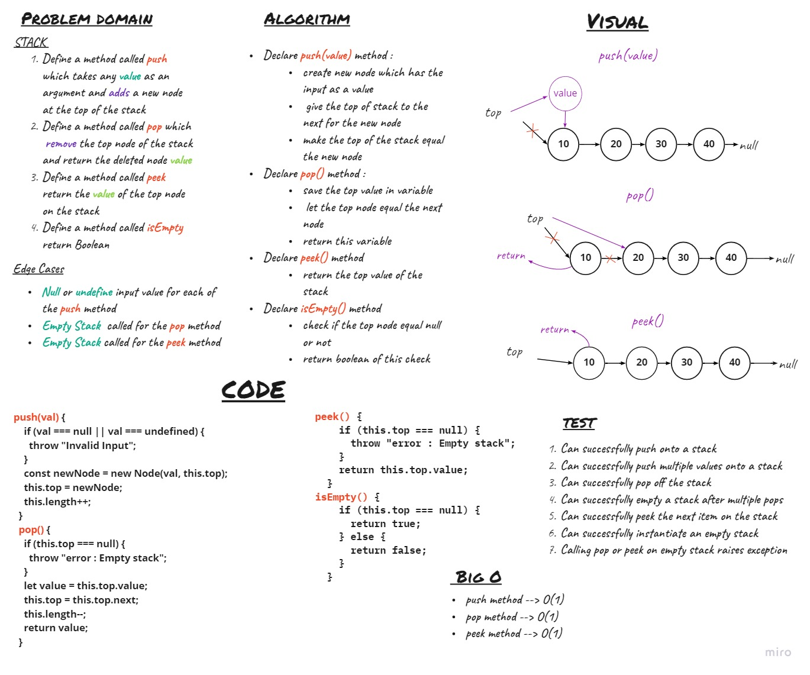
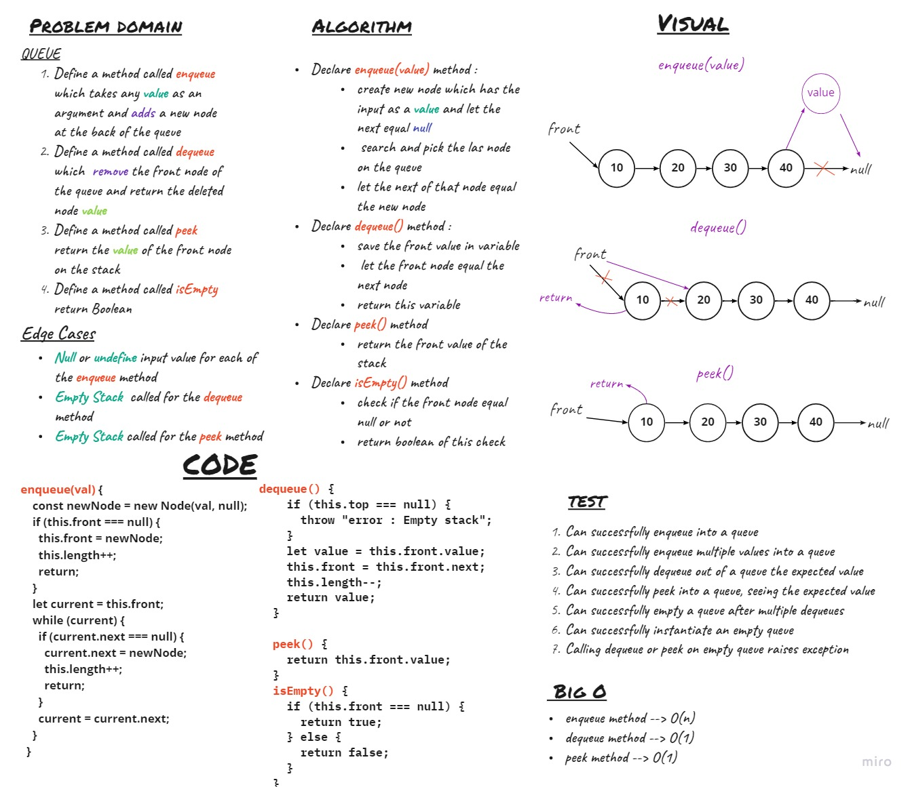

# Stacks and Queues
Stack is a container of objects that are inserted and removed according to the last-in first-out (LIFO) principle. Queue is a container of objects (a linear collection) that are inserted and removed according to the first-in first-out (FIFO) principle.

## Challenge

## Approach & Efficiency
**STACK**

- `push` 
    * time --- >O(1)
    * space ---> O(1)

- `pop` 
    * time --- >O(1)
    * space ---> O(1)
- `peek`
   * time --- >O(1)
    * space ---> O(1)
- `isEmpty`
    * time --- >O(1)
    * space ---> O(1)

**QUEUE**

- `enqueue` 
    * time --- >O(n)
    * space ---> O(1)

- `dequeue` 
    * time --- >O(1)
    * space ---> O(1)
- `peek`
   * time --- >O(1)
    * space ---> O(1)
- `isEmpty`
    * time --- >O(1)
    * space ---> O(1)

## API
**STACK**

- `push` 
    Add input value to the top of   stack

- `pop` 
    remove and return top value from  the stack
- `peek`
   return the top value of the stack
- `isEmpty`
    return boolean

**QUEUE**

- `enqueue` 

    Add input value to back of the  queue

- `dequeue` 

    remove and return front value from  the queue
- `peek`

   return the front value of the stack
- `isEmpty`

    return boolean