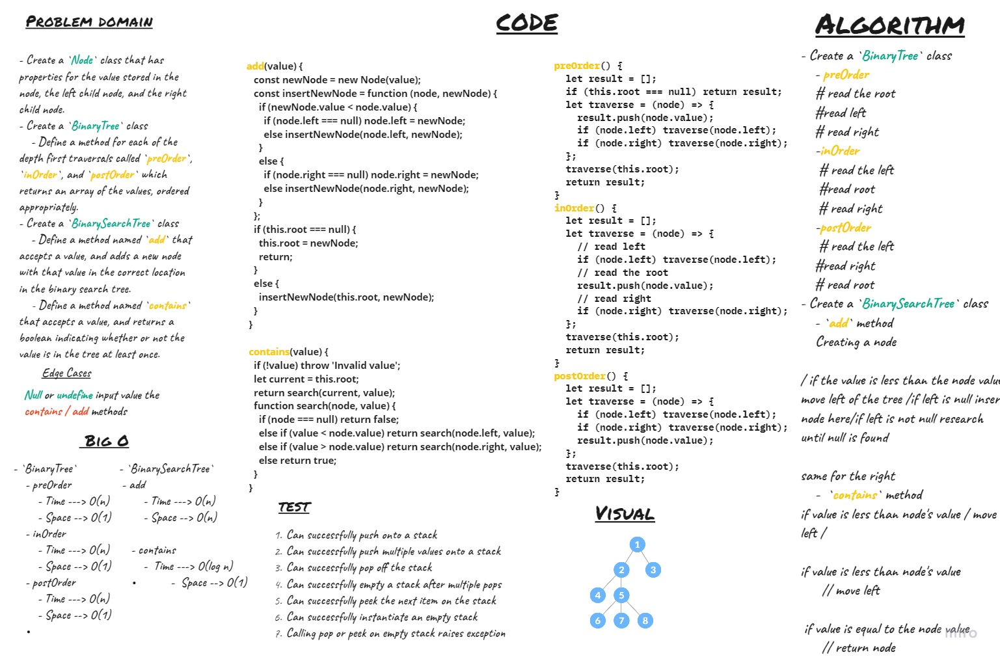

# Trees
- Create a `Node` class that has properties for the value stored in the node, the left child node, and the right child node.
- Create a `BinaryTree` class
    - Define a method for each of the depth first traversals called `preOrder`, `inOrder`, and `postOrder` which returns an array of the values, ordered appropriately.
- Create a `BinarySearchTree` class
    - Define a method named `add` that accepts a value, and adds a new node with that value in the correct location in the binary search tree.
    - Define a method named `contains` that accepts a value, and returns a boolean indicating whether or not the value is in the tree at least once.

## Challenge

## Approach & Efficiency
- `BinaryTree`
    - preOrder
        - Time ---> O(n)
        - Space --> O(1)
    - inOrder
        - Time ---> O(n)
        - Space --> O(1)
    - postOrder  
        - Time ---> O(n)
        - Space --> O(1)
- `BinarySearchTree`
    - add
        - Time ---> O(n)
        - Space --> O(n)
        
    - contains
        -  Time ---> O(log n)
        -  Space --> O(1)
## API

- `BinaryTree`
    - preOrder

        output -- > Array []
    - inOrder

        output -- > Array []
    - postOrder 

        output -- > Array []
- `BinarySearchTree`
    - add
        - input --> new node value
        
    - contains
        -  input ---> target value
        -  output --> Boolean
